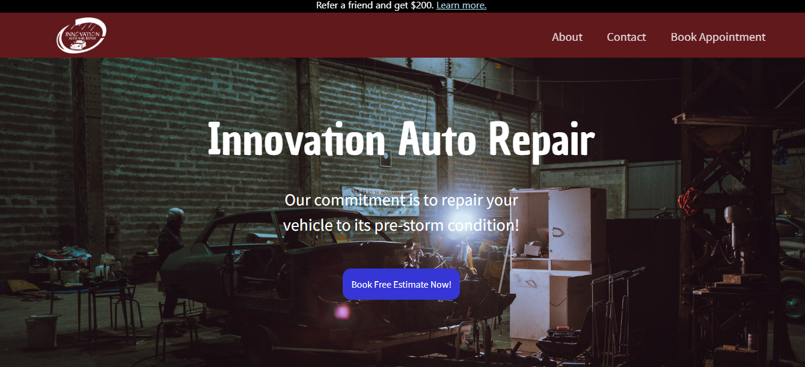

# Innovation Auto
 <br>
Innovation Auto Hail Repair works to restore your vehicle to its pre-storm condition. We work to bring back the value to your car. With experienced technicians working on your vehicle we can guarantee your vehicle is in good hands. Don’t have insurance? No problem! We give special discounts for those paying out of pocket. Have a non-hail related dent? We fix those too! Contact us for any questions or concerns! <br>
*This web application is a work in progress*

## Table of Contents

  * [Innovation Auto](#innovation-auto)
  * [Installation](#installation)
  * [Usage](#usage)
  * [Motivation](#motivation)
  * [Authors](#authors)
  * [Technologies](#technologies)
  * [Image](#image)
  * [Deployed Application](#deployed-application)

## Installation
To install necessary dependencies, run the following command:

```
npm i
```
## Usage
```
npm run dev
```

## Motivation
We were tasked with building a website for a small business. We wanted to help them simplify their estimate appointment scheduling as well as advertise their services. This will also help people find their company easier.


## Authors
* **Grayson Deese** - [GitHub](https://github.com/graysondeese)
* **Ryan Devenney** - [GitHub](https://github.com/ryand67)
* **Emily Renegar** - [GitHub](https://github.com/egrenegar)
* **Josh Rivera** - [GitHub](https://github.com/JRivera-31)

If you have any questions feel free to contact any of the Authors.


## Technologies
<b>Built with</b>
- [Bootstrap](https://getbootstrap.com/)
- [CSS3](https://developer.mozilla.org/en-US/docs/Web/CSS)
- [HTML5](https://developer.mozilla.org/en-US/docs/Web/Guide/HTML/HTML5)
- [Javascript](https://developer.mozilla.org/en-US/docs/Web/JavaScript)
- [Material](https://material-ui.com/)
- [MongoDB](https://www.mongodb.com/)
- [Mongoose](https://mongoosejs.com/docs/)
- [Next.js](https://nextjs.org/)
- [Node.js](https://nodejs.org/en/docs/)
- [React.js](https://reactjs.org/)


## Image


## Deployed Application
Deployed: https://innovation-auto-repair.vercel.app/ <br>
*This site will eventually have its own domain name*
